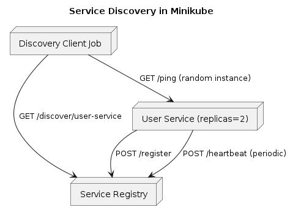
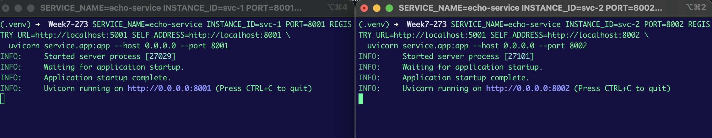
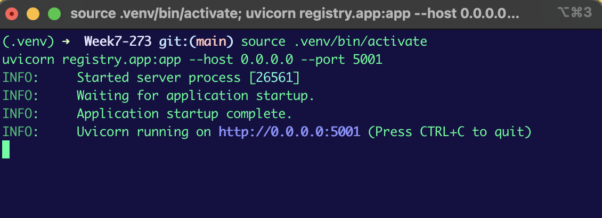
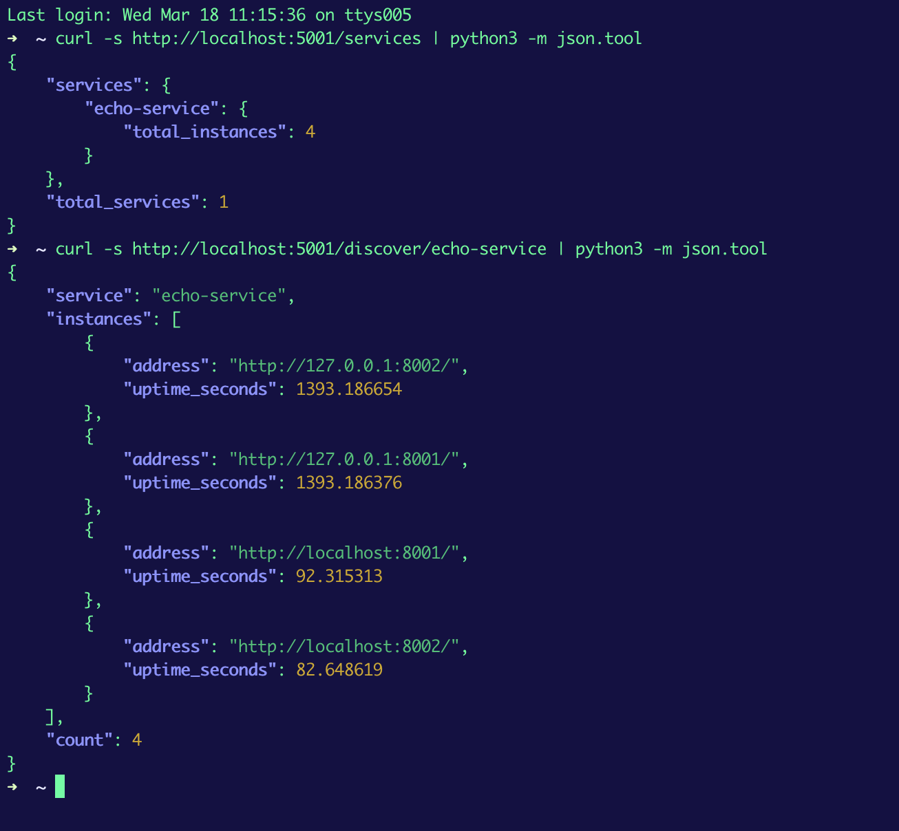
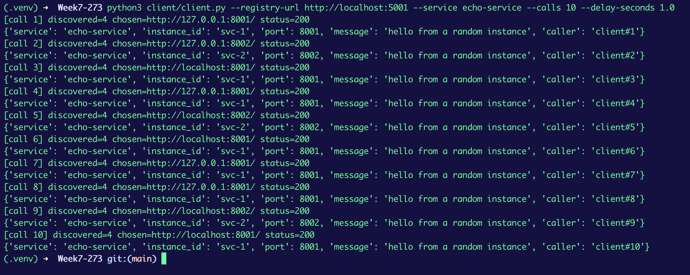
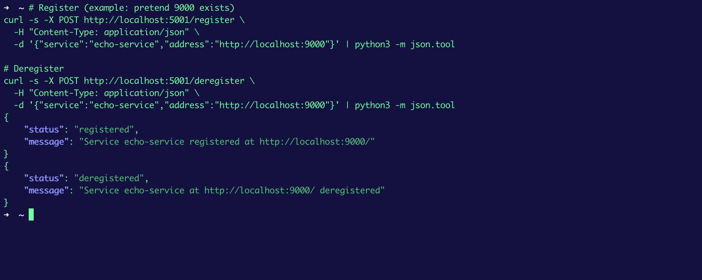

# Service Discovery Demo (Minikube + Kubernetes + FastAPI)

This repo demonstrates a minimal **service discovery** flow inside **Minikube**:

- Run **2 service instances** (same service name, `user-service`, `replicas: 2`)
- Each instance **registers** itself with a **service registry**
- A **client Job** discovers the service via the registry
- The client **calls a random discovered instance**

Inspired by the service-registry idea from the template repo: [ranjanr/ServiceRegistry](https://github.com/ranjanr/ServiceRegistry)

## Architecture diagram




## Prerequisites

- Minikube
- kubectl
- Docker
- make

## Build and deploy (single command)

```bash
make up
```

## Verify service instances are running

```bash
kubectl get pods -l app=user-service -o wide
```

<!--  -->

## Verify registry discovery (curl)

Start a port-forward to the registry Service (keep it running while you test):

```bash
kubectl port-forward service/service-registry 5001:5001
```

In another terminal, run:

```bash
curl -s http://localhost:5001/health | python3 -m json.tool
curl -s http://localhost:5001/services | python3 -m json.tool
curl -s http://localhost:5001/discover/user-service | python3 -m json.tool
```

Expected: `"count": 2` and two distinct pod IP addresses for `user-service`.

<!--  -->
<!--  -->

## Call a random instance (client Job)

Run:

```bash
make client
make logs
```

Expected: client logs should show discovery returning 2 instances and a random selected `chosen` address, followed by a `/ping` JSON response.

<!--  -->

## Curl test: hit an instance directly (optional)

You can also port-forward to the service and call `/ping` directly:

```bash
kubectl port-forward service/user-service 8001:8001
curl -s http://localhost:8001/ping | python3 -m json.tool
```

## Optional: manual register/deregister (registry curl)

These commands are mainly useful for testing the registry API:

```bash
# Register (example address)
curl -s -X POST http://localhost:5001/register \
  -H "Content-Type: application/json" \
  -d '{"service":"user-service","address":"http://localhost:9000"}' | python3 -m json.tool

# Deregister
curl -s -X POST http://localhost:5001/deregister \
  -H "Content-Type: application/json" \
  -d '{"service":"user-service","address":"http://localhost:9000"}' | python3 -m json.tool
```

<!--  -->

## Cleanup

```bash
make clean
```

# Microservice Discovery Demo (Python + FastAPI)

This repo demonstrates a minimal **service discovery** flow:

- Run **2 service instances**
- Each instance **registers** itself with a **service registry**
- A **client discovers** the service via the registry
- The client **calls a random instance**

Inspired by the service-registry idea from the template repo: [ranjanr/ServiceRegistry](https://github.com/ranjanr/ServiceRegistry)

## Architecture diagram 


## Setup

### Prerequisites

- Python 3.9+ recommended (Python 3 works)

### Install

```bash
python3 -m venv .venv
source .venv/bin/activate
pip install -r requirements.txt
```

## Run (3 terminals)

### Terminal 1: Start the registry

```bash
source .venv/bin/activate
uvicorn registry.app:app --host 0.0.0.0 --port 5001
```


Registry endpoints:
- `GET http://localhost:5001/health`
- `POST http://localhost:5001/register`
- `GET http://localhost:5001/discover/{service}`
- `GET http://localhost:5001/services`
- `POST http://localhost:5001/deregister`

Test registry endpoints with curl:

```bash
# Health
curl -s http://localhost:5001/health | python3 -m json.tool

# List services (initially empty)
curl -s http://localhost:5001/services | python3 -m json.tool
```

### Terminal 2: Start service instance #1 (port 8001)

```bash
source .venv/bin/activate
SERVICE_NAME=echo-service INSTANCE_ID=svc-1 PORT=8001 REGISTRY_URL=http://localhost:5001 SELF_ADDRESS=http://localhost:8001 \
  uvicorn service.app:app --host 0.0.0.0 --port 8001
```

### Terminal 3: Start service instance #2 (port 8002)

```bash
source .venv/bin/activate
SERVICE_NAME=echo-service INSTANCE_ID=svc-2 PORT=8002 REGISTRY_URL=http://localhost:5001 SELF_ADDRESS=http://localhost:8002 \
  uvicorn service.app:app --host 0.0.0.0 --port 8002
```


Service endpoints (either instance):
- `GET http://localhost:8001/health`
- `GET http://localhost:8001/work`

Test service endpoints with curl:

```bash
curl -s http://localhost:8001/health | python3 -m json.tool
curl -s "http://localhost:8001/work?caller=curl" | python3 -m json.tool

curl -s http://localhost:8002/health | python3 -m json.tool
curl -s "http://localhost:8002/work?caller=curl" | python3 -m json.tool
```

### Call a random instance (client)

Run this after both instances are up and registered:

```bash
source .venv/bin/activate
python3 client/client.py --registry-url http://localhost:5001 --service echo-service --calls 10 --delay-seconds 1.0
```

Expected output (example): the `chosen=` address should switch between `8001` and `8002` over multiple calls.


## Test the registry using curl (in addition to the client)

Once both service instances are running, you can verify discovery via curl:

```bash
# List registered services
curl -s http://localhost:5001/services | python3 -m json.tool

# Discover instances for echo-service
curl -s http://localhost:5001/discover/echo-service | python3 -m json.tool
```


You can also manually register/deregister an instance (optional):

```bash
# Register (example: pretend 9000 exists)
curl -s -X POST http://localhost:5001/register \
  -H "Content-Type: application/json" \
  -d '{"service":"echo-service","address":"http://localhost:9000"}' | python3 -m json.tool

# Deregister
curl -s -X POST http://localhost:5001/deregister \
  -H "Content-Type: application/json" \
  -d '{"service":"echo-service","address":"http://localhost:9000"}' | python3 -m json.tool
```


