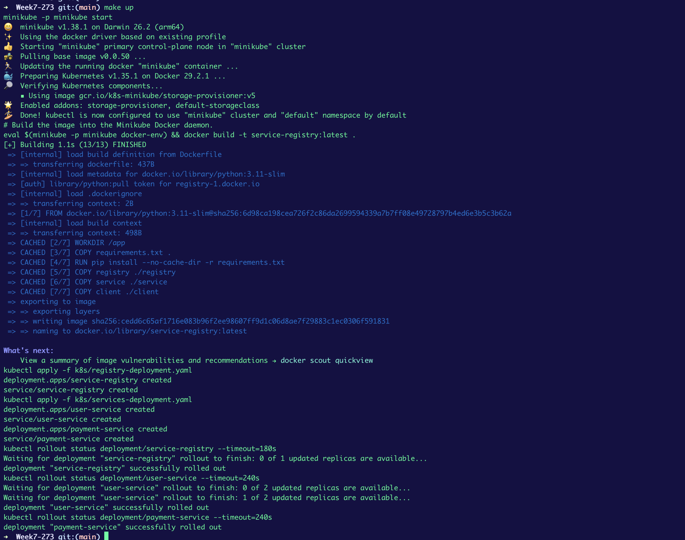
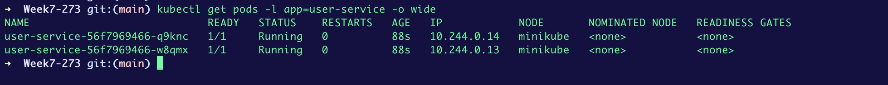
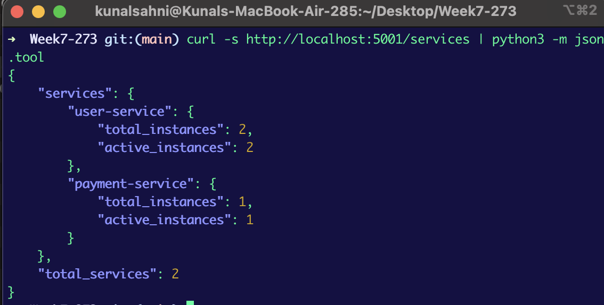
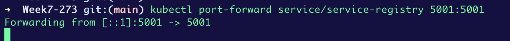
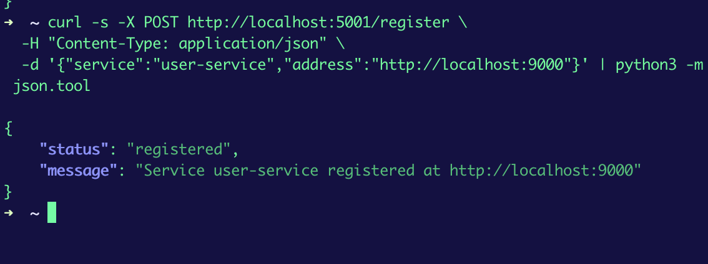
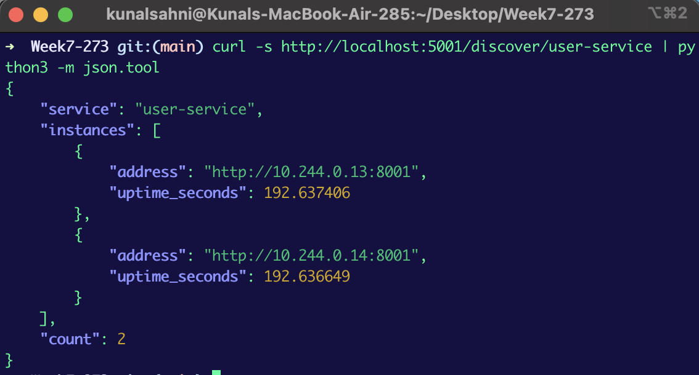
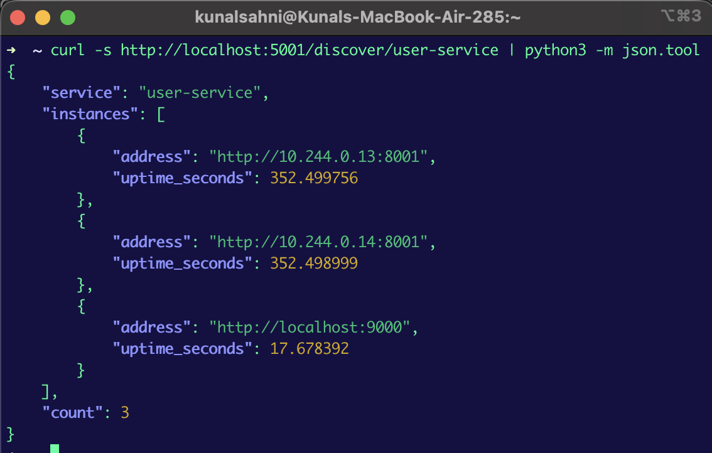
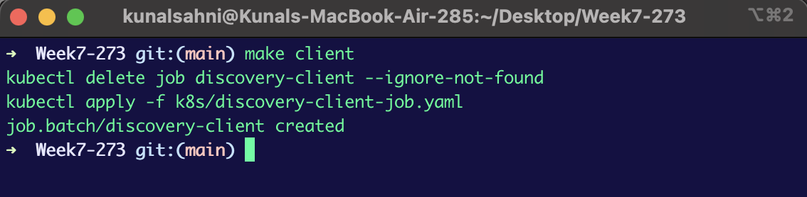
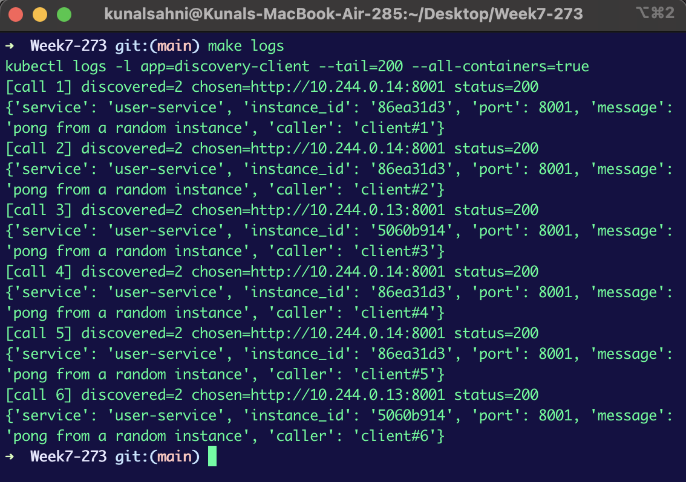
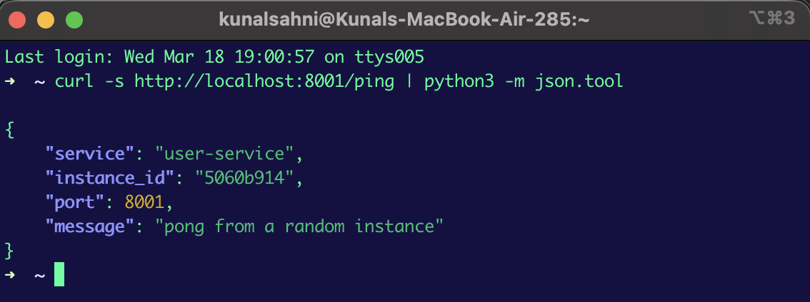

# Service Discovery Demo (Minikube + Kubernetes + FastAPI)

This repo demonstrates a minimal **service discovery** flow inside **Minikube**:

- Run **2 service instances** (same service name, `user-service`, `replicas: 2`)
- Each instance **registers** itself with a **service registry**
- A **client Job** discovers the service via the registry
- The client **calls a random discovered instance**

Inspired by the service-registry idea from the template repo: [ranjanr/ServiceRegistry](https://github.com/ranjanr/ServiceRegistry)

## Architecture diagram


## Prerequisites

- Minikube
- kubectl
- Docker
- make

### Install prerequisites (macOS)

```bash
# Homebrew (skip if you already have it): https://brew.sh
/bin/bash -c "$(curl -fsSL https://raw.githubusercontent.com/Homebrew/install/HEAD/install.sh)"

brew install minikube kubectl docker make
```

Then start Docker Desktop once so the Docker daemon is running.

## Build and deploy (single command)

```bash
make up
```



## Verify service instances are running

```bash
kubectl get pods -l app=user-service -o wide
```




## Verify registry discovery (curl)

Start a port-forward to the registry Service (keep it running while you test):

```bash
kubectl port-forward service/service-registry 5001:5001
```



In another terminal, run:

```bash
curl -s http://localhost:5001/health | python3 -m json.tool
curl -s http://localhost:5001/services | python3 -m json.tool
curl -s http://localhost:5001/discover/user-service | python3 -m json.tool
```

Expected: `"count": 2` and two distinct pod IP addresses for `user-service`.





## Call a random instance (client Job)

Run:

```bash
make client
make logs
```




Expected: client logs should show discovery returning 2 instances and a random selected `chosen` address, followed by a `/ping` JSON response.

## Curl test: hit an instance directly (optional)

You can also port-forward to the service and call `/ping` directly:

```bash
kubectl port-forward service/user-service 8001:8001
curl -s http://localhost:8001/ping | python3 -m json.tool
```



## Optional: manual register/deregister (registry curl)

These commands are mainly useful for testing the registry API:

```bash
# Register (example address)
curl -s -X POST http://localhost:5001/register \
  -H "Content-Type: application/json" \
  -d '{"service":"user-service","address":"http://localhost:9000"}' | python3 -m json.tool

# Deregister
curl -s -X POST http://localhost:5001/deregister \
  -H "Content-Type: application/json" \
  -d '{"service":"user-service","address":"http://localhost:9000"}' | python3 -m json.tool
```

<!--  -->

## Cleanup

```bash
make clean
```
